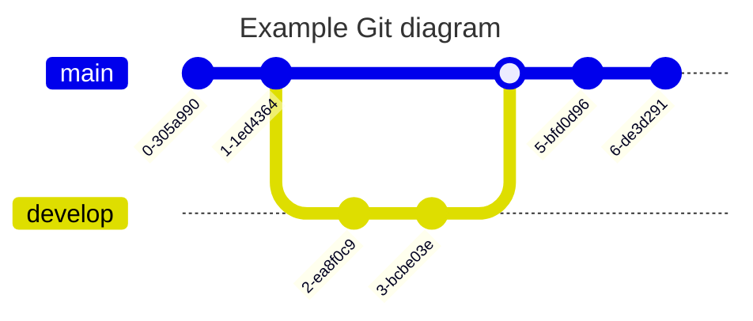

1.GPT + PlantUML自动代码绘图：

PlantUML是一种可以基于给定代码自动绘图的框架，可以由gpt生成代码来实现自动绘图，prompt参考：

> 针对以下内容使用 PlantUML语法，选择最适合呈现内容中的逻辑关系的图表格式并生成对应的代码，并给出选择该图表的理由：

绘制后的图像可以在[PlantUML官方在线绘图](https://www.plantuml.com/plantuml/uml/)中实时绘制和调整。

PlantUML另一个优点是可以在[PlantUML官方免费模板库](https://real-world-plantuml.com/)中找到与自己需求相近的图表，然后直接交给GPT修改为自己的内容。

***

2.结合GPT + Mermaid.js + Markdown实现自动绘图：

可以使用GPT的prompt来实现自动生成给定内容的Mermaid.js代码并基于Markdown绘制对应的图表：

> 针对以下内容 **[段落]**使用 mermaid.js 语法，生成一个**[图表类型]**示范。
>
> 针对以下内容，使用 mermaid.js 语法，选择最适合呈现内容中的逻辑关系的图表格式并生成对应的代码，可选的图表包括：流程图、序列图、类图、状态图、实体关系图、用户旅程图、甘特图、饼图、象限图、需求图、Gitgraph图、C4图、思维导图、时间线图、Zenuml图和桑基图，并给出选择该图表的理由：

Mermaid.js是一个生成流程图、序列图、甘特图等图表的 JavaScript 库。以下是使用 Mermaid.js 可以绘制的图表类型以及对应的示例代码。

如果要修改图表的**字体颜色**等格式，可以参考：[Mermaid主题列表](https://mermaid.nodejs.cn/config/theming.html)

1. 流程图 (Flowchart)

2. 序列图 (Sequence Diagram)

3. 甘特图 (Gantt Diagram)

4. 类图 (Class Diagram)

5. 状态图 (State Diagram)

6. 用户旅程图 (User Journey Diagram)

7. 实体关系图 (Entity Relationship Diagram)


8. 饼图 (Pie Chart)

9. 象限图 (Quadrant Diagram)

10. 需求图 (Requirement Diagram)

11. Gitgraph (Git) 图

12. C4 图

13. 思维导图 (Mindmap)

14. 时间线图 (Timeline)

15. Zenuml

16. 桑基图 (Sankey Diagram)


17. XY图（XYChart）

    ```mermaid
    xychart-beta
            title "Sales Revenue"
            x-axis [jan, feb, mar, apr, may, jun, jul, aug, sep, oct, nov, dec]
            y-axis "Revenue (in $)" 4000 --> 11000
            bar [5000, 6000, 7500, 8200, 9500, 10500, 11000, 10200, 9200, 8500, 7000, 6000]
            line [5000, 6000, 7500, 8200, 9500, 10500, 11000, 10200, 9200, 8500, 7000, 6000]
    ```

    ***
    
    3.其他代码绘图或者手动绘图网站：
    
    1. [draw.io](https://draw.io/) - 一个免费的在线图表绘制工具，支持流程图、UML图、ER图等多种图表类型，用户界面直观，支持多人协作。
    2. [LucidChart](https://www.lucidchart.com/) - 一个强大的在线图表绘制和数据可视化平台，提供丰富的图表类型和模板，支持团队协作，适合专业和商业用途。
    3. [ProcessOn](https://www.processon.com/) - 一个在线协作绘图平台，提供流程图、思维导图、UML图等多种绘图工具，适合团队协作和项目管理。
    4. [Zen Flowchart](https://www.zenflowchart.com/) - 一个简单易用的在线流程图绘制工具，界面简洁，支持导出和分享，适合快速创建流程图。
    5. [Code-flowchart.js](https://flowchart.js.org/) - 一个基于 JavaScript 的工具，可以将代码转换为流程图，支持多种编程语言，有助于理解和可视化代码结构。
    6. [Code-js-sequence-diagrams](https://bramp.github.io/js-sequence-diagrams/) - 一个 JavaScript 库，用于将文本转换为序列图，适用于文档和演示文稿中的快速序列图绘制。
    7. [Code-websequence](https://www.websequencediagrams.com/) - 一个在线序列图绘制工具，允许用户通过文本来描述和生成序列图，支持自定义样式和导出功能。
    8. [Code-yuml.me](https://yuml.me/) - 一个在线UML图绘制工具，可以通过简单的文本语法来创建类图、序列图和用例图等，支持直接在浏览器中编辑和分享。